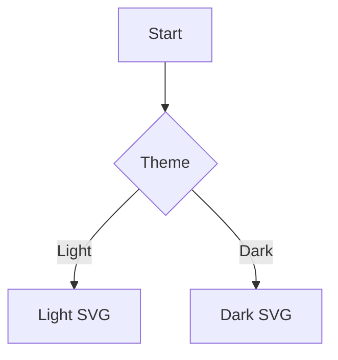

# starlight-beautiful-mermaid

Astro integration for rendering Mermaid diagrams at build time with automatic light/dark theming.

## Install

```bash
npm install starlight-beautiful-mermaid
```

## Usage

```js
// astro.config.mjs
import { defineConfig } from "astro/config";
import starlight from "@astrojs/starlight";
import starlightBeautifulMermaid from "starlight-beautiful-mermaid";

export default defineConfig({
  integrations: [
    starlight({
      integrations: [starlightBeautifulMermaid()]
    })
  ]
});
```

````md

````

## Options

```ts
starlightBeautifulMermaid({
  autoTheming: true,
  theme: { theme: "neutral" },
  lightTheme: { theme: "default" },
  darkTheme: { theme: "dark" },
  failOnError: false,
  themeSelectors: {
    light: ":root[data-theme=\"light\"]",
    dark: ":root[data-theme=\"dark\"]"
  }
});
```

| Option | Type | Default | Notes |
| --- | --- | --- | --- |
| `autoTheming` | `boolean` | `false` | When `true`, renders light and dark SVGs and swaps with CSS selectors. |
| `theme` | `object` | `{}` | Base Mermaid config applied to all diagrams. |
| `lightTheme` | `object` | `{}` | Extra Mermaid config merged for light diagrams. Only used when `autoTheming` is `true`. |
| `darkTheme` | `object` | `{}` | Extra Mermaid config merged for dark diagrams. Only used when `autoTheming` is `true`. |
| `failOnError` | `boolean` | `false` | When `true`, build fails on Mermaid render errors. |
| `themeSelectors` | `{ light: string; dark: string }` | Starlight defaults | CSS selectors used to reveal light/dark SVGs. |

## Theming

When `autoTheming` is enabled, diagrams render twice and are revealed via CSS selectors. The defaults match Starlight:

```ts
starlightBeautifulMermaid({
  autoTheming: true,
  themeSelectors: {
    light: ":root[data-theme=\"light\"]",
    dark: ":root[data-theme=\"dark\"]"
  }
});
```

If your theme uses different selectors, override them to keep the correct SVG visible.

## Per-diagram overrides

Use code fence attributes for quick overrides:

````md

````

For richer options, pass JSON with `config`:

````md
```mermaid config='{"theme":"forest","themeVariables":{"primaryColor":"#0ea5e9"}}'
flowchart LR
  A --> B
```
````

Per-diagram overrides are merged on top of global options.

## Migration from astro-mermaid

1. Replace the integration import and usage in `astro.config.mjs`.
2. Move any shared Mermaid config to `theme`, `lightTheme`, and `darkTheme`.
3. If you used `themeVariables`, keep them inside these config objects or per-diagram `config` JSON.
4. Mermaid code fences stay the same, but per-diagram overrides should use `theme="..."` or `config='{"..."}'`.

```diff
- import mermaid from "astro-mermaid";
+ import starlightBeautifulMermaid from "starlight-beautiful-mermaid";

  export default defineConfig({
    integrations: [
-     mermaid(),
+     starlight({
+       integrations: [starlightBeautifulMermaid()]
+     })
    ]
  });
```

## Development

```bash
npm run build
npm test
```
