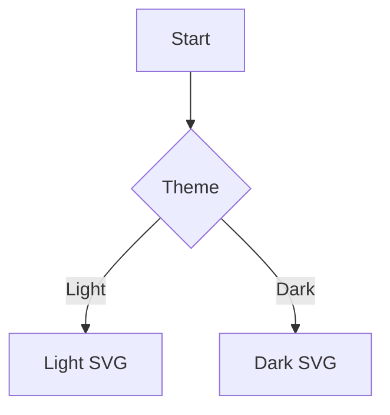

# Starlight + Beautiful Mermaid




```mermaid config='{"theme":"forest","themeVariables":{"primaryColor":"#0ea5e9"}}'
sequenceDiagram
  participant User
  participant Docs
  User->>Docs: Render Mermaid
  Docs-->>User: SVG output
```
